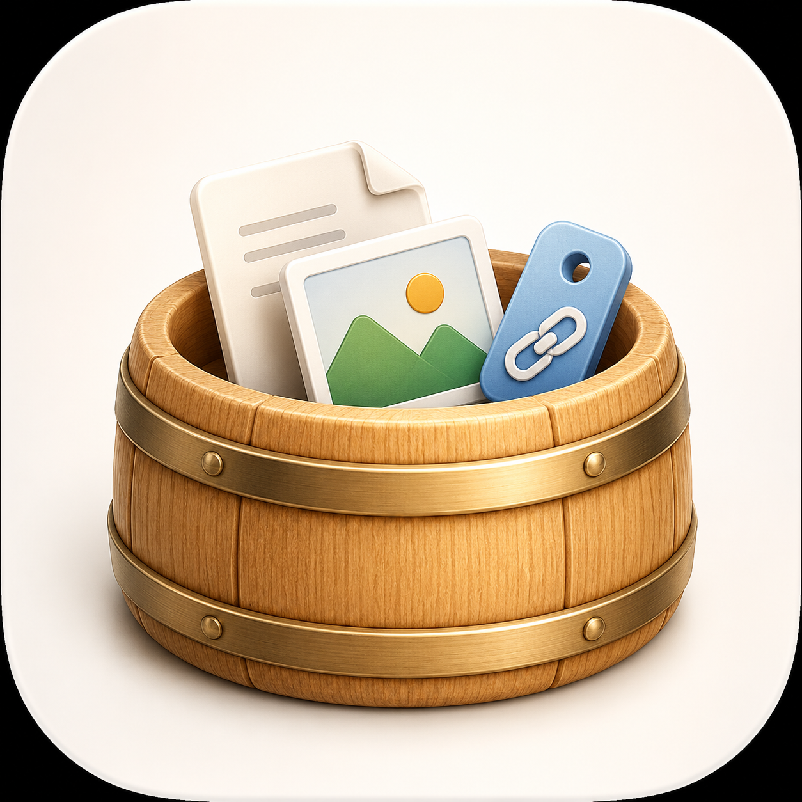

# Barrel



Barrel is a native, macOS-only SwiftUI shelf for temporarily holding files,
images, links, and text. It copies held files into its own Application Support
directory, so it doesn't modify the originals.

## Requirements

- macOS 14 or later.
- Xcode with the macOS development tools selected.
- Swift Package Manager for command-line builds and tests.

## Hold and organize items

You can add items by dragging them onto the shelf, choosing files in the open
panel, or pasting supported clipboard content. You can then drag items out,
open them, reveal files in Finder, rename them, pin them, or combine them into
stacks.

By default, Barrel hides completely beyond the left edge of the display under
your pointer. Move the pointer to that edge to reveal the shelf after a short
delay. The same shelf follows the pointer across displays and Spaces, appears
over full-screen apps, and doesn't take keyboard focus when you reveal it by
hovering. It remains open while you drag items into or out of it and hides only
after the drag ends and the pointer leaves.

In **Settings**, you can move the shelf to the right edge or turn off
**Auto-hide shelf at screen edge** to keep it visible. Barrel preserves these
settings when you relaunch it.

Clipboard history is off by default. If you enable it, Barrel polls for
supported clipboard changes and gives automatic captures a 24-hour lifetime.
You can change the lifetime or pin an item to keep it.

## Recall items

Barrel provides these system integrations:

- A configurable global shortcut. The default is
  **Control-Option-Space**. You can also choose **Control-Shift-Space** or
  **Command-Option-B**.
- App Intents for holding files, text, and links, showing the shelf, and
  clearing expired items.
- Core Spotlight results for live, non-clipboard items. Barrel indexes item
  metadata and text snippets, but it doesn't index managed file contents.

Selecting a Barrel Spotlight result opens the shelf and selects that item.
See [Privacy and local data](docs/privacy.md) for indexing details.

## Retention, Trash, and storage

Manual imports and App Intent captures don't expire by default. Expired items
move to Trash unless you pin them. Items remain recoverable in Trash for seven
days, or until you empty Trash or delete them permanently.

Barrel defaults to a 1 GB storage quota. Cleanup moves expired, unpinned items
to Trash first, followed by the oldest unpinned clipboard captures. It doesn't
remove deliberate imports only to meet the quota. If physical storage remains
above the quota, Barrel asks you to empty Trash or delete items manually.

## Optional multi-Mac sync

CloudKit sync is off by default. Local imports, retention, Trash, search, and
shortcuts continue to work without CloudKit or an Apple Developer account.

The repository uses the placeholder container
`iCloud.dev.bruno.barrel`. You must provision and sign that container before
you enable sync. See [Configure optional CloudKit sync](docs/cloudkit-setup.md)
for the exact capability, entitlement, and schema requirements.

## Build and verify

Build the app bundle in `dist/` and launch it:

```sh
make app
```

Build the bundle, inspect its required files, launch its exact executable,
verify the launched PID, and terminate only that process:

```sh
make verify
```

Run the package tests:

```sh
swift test
```

If your active developer directory doesn't point to the full Xcode install,
run commands with this prefix:

```sh
DEVELOPER_DIR=/Applications/Xcode.app/Contents/Developer swift test
```

The verification command doesn't require CloudKit entitlements. It validates
the local app bundle and launch path only.

## Project notes

Barrel is an original implementation inspired by drag-and-drop holding
utilities. It doesn't copy another product's branding, artwork, or proprietary
code.
